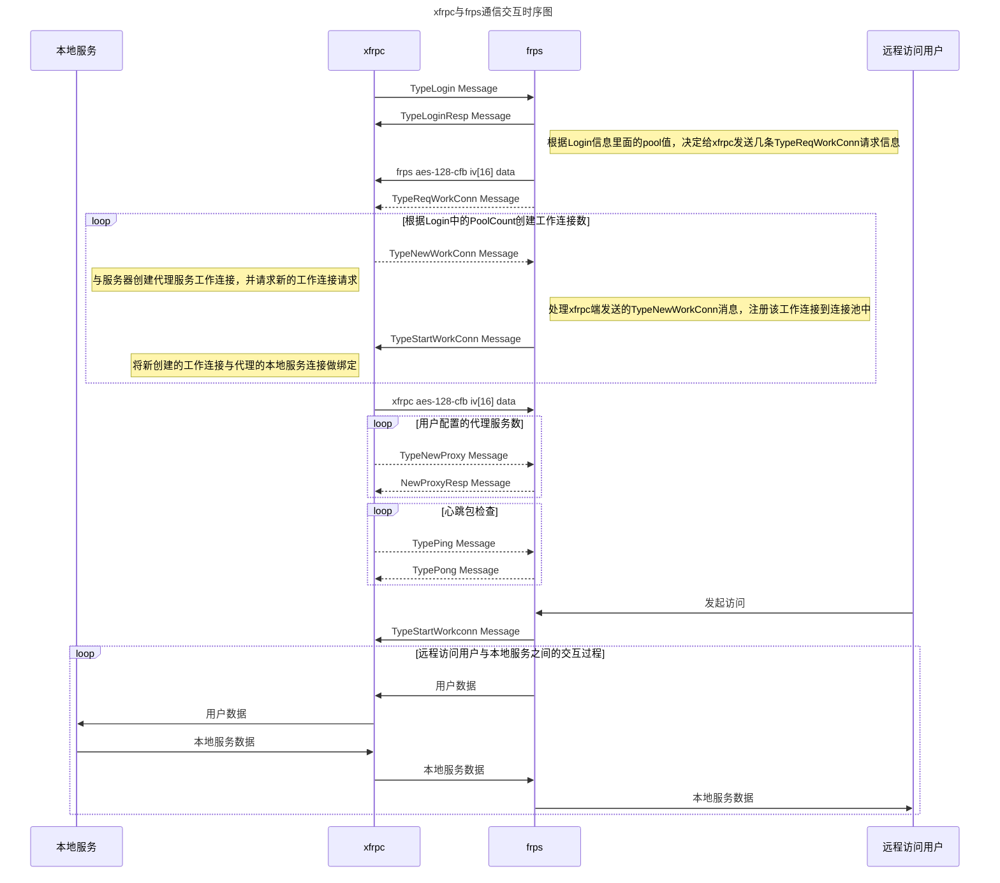

## What is xfrpc 

`xfrpc` is [frp](https://github.com/fatedier/frp) client implemented by c language for [OpenWRT](https://github.com/openwrt/openwrt)
The motivation to start xfrpc project is that we are OpenWRTer, and openwrt usually run in devices which have limit ROM and RAM space, however frpc always need more space and memory; therefore we launched xfrpc project.

## Development Status

xfrpc partially compitable with latest frp release feature, It targets to fully compatible with latest frp release.

the following table is detail  compatible feature:

| Feature  | xfrpc | frpc |
| ------------- | ------------- | ---------|
| tcp  | Yes |	 Yes  |
| tcpmux  | Yes |	 Yes  |
| http  | Yes |	 Yes  |
| https  | Yes |  Yes  |
| custom_domains | Yes | Yes |
| subdomain | Yes | Yes |
| use_encryption | No | Yes |
| use_compression | No | Yes |
| udp  | No |  Yes  |
| p2p  | No |  Yes  |
| xtcp  | No |  Yes  |
| vistor  | No |  Yes  |


## Architecture


## Sequence Diagram



## Quickstart for Ubuntu 20.04.3 LTS

xfrp need [libevent](https://github.com/libevent/libevent) [openssl-dev](https://github.com/openssl/openssl) and [json-c](https://github.com/json-c/json-c) support

Before compile xfrp, please install `libevent` and `json-c` in your system.

Install json-c libevent in ubuntu 20.04 LTS

```shell
sudo apt-get install -y libjson-c-dev
sudo apt-get install -y libevent-dev
```

**Fork** xfrpc on GitHub

```shell
git clone https://github.com/${YOUR_GITHUB_ACCOUNT_NAME}/xfrpc.git
cd xfrp
mkdir build
cmake ..
make
```

## Compile on OpenWrt

xfrpc was recruited by openwrt community since version 1.04.515

anyway I highly recommend you to use latest version 

in order to compile xfrpc in openwrt sdk environment, you should firstly `make menuconfig`, then select `Network --> Web Servers/Proxies  ---> xfrpc`

## Quick start

**before using xfrpc, you should get frps server: [frps](https://github.com/fatedier/frp/releases)**

+ frps 

frps use latest release 0.42.0

```
# frps.ini
[common]
bind_port = 7000
```

run frps

```
./frps -c frps.ini
```

+ xfrpc tcp

```
#xfrpc_mini.ini 
[common]
server_addr = your_server_ip
server_port = 7000

[ssh]
type = tcp
local_ip = 127.0.0.1
local_port = 22
remote_port = 6128
```

+ xfrpc http&https

 compare with supporting tcp, supporting http&https need to add vhost_http_port&vhost_https_port in frps.ini as the following
 
```
# frps.ini
[common]
bind_port = 7000
vhost_http_port = 80
vhost_https_port = 443
```

```
# xfrpc_mini.ini 
[common]
server_addr = x.x.x.x
server_port = 7000

[http]
type = http
local_port = 80
custom_domains = www.example.com

[https]
type = https
local_port = 443
custom_domains = www.example.com
```

+ Run in debug mode 

```shell
xfrpc -c frpc_mini.ini -f -d 7 
```

+ Run in release mode :

```shell
xfrpc -c frpc_mini.ini -d 0
```

## Openwrt luci configure ui

If running xfrpc in openwrt box, [luci-app-xfrpc](https://github.com/liudf0716/luci-app-xfrpc) is a good choice 

luci-app-xfrpc was recruited by [luci project](https://github.com/openwrt/luci) 

## How to contribute our project

See [CONTRIBUTING](https://github.com/liudf0716/xfrpc/blob/master/CONTRIBUTING.md) for details on submitting patches and the contribution workflow.

## Contact

QQ群 ： [331230369](https://jq.qq.com/?_wv=1027&k=47QGEhL)


## Please support us and star our project

[](https://star-history.com/#liudf0716/xfrpc&Date)

## 打赏

支付宝打赏


微信打赏


 <!--
 
## 广告

想学习OpenWrt开发，但是摸不着门道？自学没毅力？基础太差？怕太难学不会？跟着佐大学OpenWrt开发入门培训班助你能学有所成

报名地址：https://forgotfun.org/2018/04/openwrt-training-2018.html

-->
