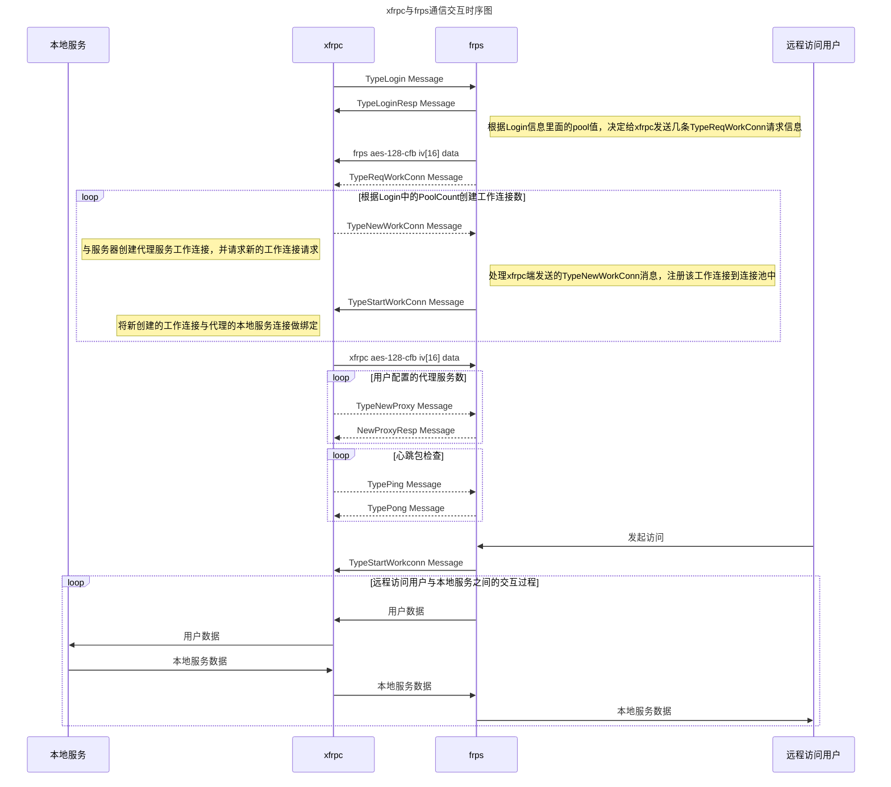

## What is xfrpc 

The xfrpc project is an implementation of frp client written in C language for OpenWRT and IOT system. The main motivation of this project is to provide a lightweight solution for devices with limited resources such as OpenWRT devices which often have limited ROM and RAM space. The project aims to provide a frp client that uses less space and memory than other available options.

## Development Status

xfrpc partially compitable with latest frp release feature, It targets to fully compatible with latest frp release.

the following table is detail  compatible feature:

| Feature  | xfrpc | frpc |
| ------------- | ------------- | ---------|
| tcp  | Yes |	 Yes  |
| tcpmux  | Yes |	 Yes  |
| http  | Yes |	 Yes  |
| https  | Yes |  Yes  |
| custom_domains | Yes | Yes |
| subdomain | Yes | Yes |
| use_encryption | No | Yes |
| use_compression | No | Yes |
| udp  | No |  Yes  |
| p2p  | No |  Yes  |
| xtcp  | No |  Yes  |
| stcp  | No |  Yes  |


## Architecture


## Sequence Diagram



## How to build

### Build on Ubuntu 20.04.3 LTS

To run xfrpc on Ubuntu 20.04 LTS, you will need to have the following libraries installed: libevent, openssl-dev, and json-c. Use the following command in your terminal to install these libraries:

```
sudo apt-get install -y libjson-c-dev libevent-dev libssl-dev
```

Once the required libraries are installed, you can download the xfrpc source code by forking the xfrpc repository on GitHub and then cloning it to your local machine using the following command:

```
git clone https://github.com/${YOUR_GITHUB_ACCOUNT_NAME}/xfrpc.git
```

Navigate to the xfrp directory and create a build directory by using these commands:

```
cd xfrp
mkdir build
```
Use the following commands to build and install xfrpc:

```
cmake ..
make
```
This will compile xfrpc and create an executable in the build directory. You can then run xfrpc using the executable by running the appropriate command in terminal.

### Build xfrpc by Built-in thirdparty

use Built-in thirdparty build xfrpc.

require cmake version > 3.1.

To build xfrpc using the built-in third-party libraries, you can fork the xfrpc repository on GitHub and then clone it locally. Then, navigate to the xfrp directory, create a build directory, and use cmake to configure the build.

```shell
git clone https://github.com/${YOUR_GITHUB_ACCOUNT_NAME}/xfrpc.git
cd xfrp
mkdir build
cmake -D THIRDPARTY_STATIC_BUILD=ON ..
make
```

By setting THIRDPARTY_STATIC_BUILD=ON the build process will use the libraries that are included in the xfrpc source code, instead of using the libraries installed on your system.

The THIRDPARTY_STATIC_BUILD parameter is default set to OFF, which means that by default the build process will use the libraries installed on your system.

It's important to note that you will need cmake version greater than 3.1 to use this feature.


### Build static binary in Alpine container

Under project root directory

```shell
$ DOCKER_BUILDKIT=1 docker build --output out . -f docker/Dockerfile

$ ls out/
xfrpc
```

### Build on OpenWrt master

xfrpc is included in the OpenWrt community since version 1.04.515, which allows users to easily include it in their custom firmware images. It is recommended to use the latest version of xfrpc as it may have bug fixes and new features.

To include xfrpc in your OpenWrt firmware image, you can use the make menuconfig command to open the configuration menu. In the menu, navigate to "Network" and select "Web Servers/Proxies" and then select xfrpc. This will include xfrpc in the firmware image that will be built.

## Quick start for use

**before using xfrpc, you should get frps server: [frps](https://github.com/fatedier/frp/releases)**

frps is a server-side component of the FRP (Fast Reverse Proxy) system and it is used to forward incoming connections to xfrpc. 

+ frps 

To run frps, you can use the following command, providing it with the path to the frps configuration file:

```
./frps -c frps.ini
```

A sample frps.ini configuration file is provided in the example, which binds frps to listen on port 7000.

```
# frps.ini
[common]
bind_port = 7000
```

+ xfrpc tcp support

xfrpc is a client-side component of the FRP system and it can be used to forward TCP connections. To forward incoming TCP connections to a local service, you can configure xfrpc with the following example in xfrpc_mini.ini file

```
#xfrpc_mini.ini 
[common]
server_addr = your_server_ip
server_port = 7000

[ssh]
type = tcp
local_ip = 127.0.0.1
local_port = 22
remote_port = 6128
```

This configuration tells the frp server (frps) to forward incoming connections on remote port 6128 to the xfrpc client. The xfrpc client, in turn, will forward these connections to the local service running on IP address 127.0.0.1 and port 22.

+ xfrpc http&https support

 Supporting HTTP and HTTPS in xfrpc requires additional configuration compared to supporting just TCP. In the frps.ini configuration file, the vhost_http_port and vhost_https_port options must be added to specify the ports that the frp server (frps) will listen on for incoming HTTP and HTTPS connections.
 
```
# frps.ini
[common]
bind_port = 7000
vhost_http_port = 80
vhost_https_port = 443
```

It is important to ensure that the xfrpc client is properly configured to communicate with the frp server by specifying the correct server address and port in the xfrpc configuration file.

```
# xfrpc_mini.ini 
[common]
server_addr = x.x.x.x
server_port = 7000

[http]
type = http
local_port = 80
local_ip = 127.0.0.1
custom_domains = www.example.com

[https]
type = https
local_port = 443
local_ip = 127.0.0.1
custom_domains = www.example.com
```

The FRP server (frps) will forward incoming HTTP and HTTPS connections to the domain "www.example.com" to the location where xfrpc is running on the local IP and port specified in the configuration file (127.0.0.1:80 and 127.0.0.1:443 respectively).

It is important to note that the domain name "www.example.com" should be pointed to the public IP address of the FRP server (frps) so that when a user's HTTP and HTTPS connections visit the domain, the FRP server can forward those connections to the xfrpc client. This can be done by configuring a DNS server or by using a dynamic DNS service.

+ Run in debug mode 

In order to troubleshooting problem when run xfrpc, you can use debug mode. which has more information when running.

```shell
xfrpc -c frpc_mini.ini -f -d 7 
```

+ Run in release mode :

```shell
xfrpc -c frpc_mini.ini -d 0
```

It is important to note that running xfrpc in release mode will generate less log output and will run faster than in debug mode, so it is the recommended way to run xfrpc in production environment.

## Openwrt luci configure ui

If you're running xfrpc on an OpenWRT device, luci-app-xfrpc is a good option to use as it provides a web-based interface for configuring and managing xfrpc. luci-app-xfrpc is a module for the LuCI web interface, which is the default web interface for OpenWRT.

luci-app-xfrpc was adopted by the LuCI project, which is the official web interface for OpenWRT. This means that it is a supported and well-maintained option for managing xfrpc on OpenWRT devices.

luci-app-xfrpc can be installed via the opkg package manager on OpenWRT and provides a user-friendly interface for configuring the xfrpc client, including options for setting up multiple connections, custom domains and more.

## How to contribute our project

See [CONTRIBUTING](https://github.com/liudf0716/xfrpc/blob/master/CONTRIBUTING.md) for details on submitting patches and the contribution workflow.

## Contact

QQ群 ： [331230369](https://jq.qq.com/?_wv=1027&k=47QGEhL)


## Please support us and star our project

[](https://star-history.com/#liudf0716/xfrpc&Date)

## 打赏

支付宝打赏


微信打赏


 <!--
 
## 广告

想学习OpenWrt开发，但是摸不着门道？自学没毅力？基础太差？怕太难学不会？跟着佐大学OpenWrt开发入门培训班助你能学有所成

报名地址：https://forgotfun.org/2018/04/openwrt-training-2018.html

-->
