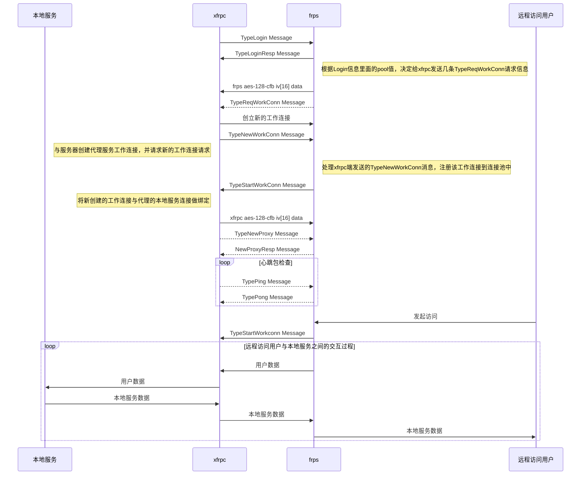

## What is xfrpc 

`xfrpc` is [frp](https://github.com/fatedier/frp) client implemented by c language for [OpenWRT](https://github.com/openwrt/openwrt) and [LEDE](https://github.com/lede-project/source) system

The motivation to start xfrpc project is that we are OpenWRTer, and openwrt usually ran in device which has little ROM and RAM space, however golang always need more space and memory; therefore we start xfrpc project to support frp.

## Development Status


## Architecture

## Sequence Diagram



## Compile

xfrp need [libevent](https://github.com/libevent/libevent) [openssl-dev](https://github.com/openssl/openssl) and [json-c](https://github.com/json-c/json-c) support

Before compile xfrp, please install `libevent` and `json-c` in your system.

Install json-c libevent in ubuntu 20.04 LTS

```shell
sudo apt-get install -y libjson-c-dev
sudo apt-get install -y libevent-dev
```

```shell
git clone https://github.com/liudf0716/xfrpc.git
cd xfrp
mkdir build
cmake ..
make
```

## Quick start

**before using xfrpc, you should have built the proxy server: [xfrps](https://github.com/liudf0716/xfrps), It's no difference with frp at usage, but support `FTP` and more embedded-client-friendly for linux.**

Run in debug mode :

```shell
xfrpc -c frpc_mini.ini -f -d 7 
```

Run in release mode :

```shell
xfrpc -c frpc_mini.ini -d 0
```

## FTP support

xfrpc support ftp proxy after version [0.07.451](https://github.com/liudf0716/xfrpc/tree/0.07.451). **Hypothesize you have built [xfrps](https://github.com/liudf0716/xfrps) succeed!**

Configure ftp in frpc.ini

```
[common]
server_addr = 111.112.113.114
server_port = 7001

[router_ftp_example]
type = ftp
local_port = 21
remote_port = 30621
remote_data_port = 30622
```

`remote_port` is the reporxy port of FTP command tunnel, and `remote_data_port` is FTP-DATA port reporxy. 

Use `-p` (PASV Mode) of `ftp` command to connect to proxy ftp server:

```
ftp -p 111.112.113.114 30621
```

----

## Todo list

- support compression
- support encrypt


## How to contribute our project

See [CONTRIBUTING](https://github.com/liudf0716/xfrpc/blob/master/CONTRIBUTING.md) for details on submitting patches and the contribution workflow.

## Contact

QQ群 ： [331230369](https://jq.qq.com/?_wv=1027&k=47QGEhL)


## Please support us and star our project

## 广告

想学习OpenWrt开发，但是摸不着门道？自学没毅力？基础太差？怕太难学不会？跟着佐大学OpenWrt开发入门培训班助你能学有所成

报名地址：https://forgotfun.org/2018/04/openwrt-training-2018.html
